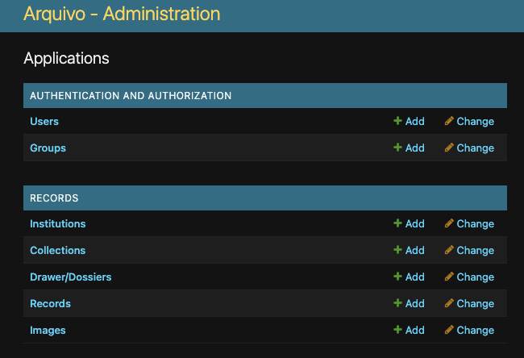
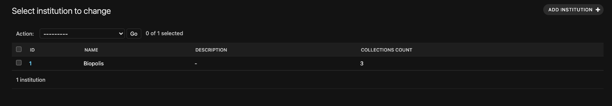
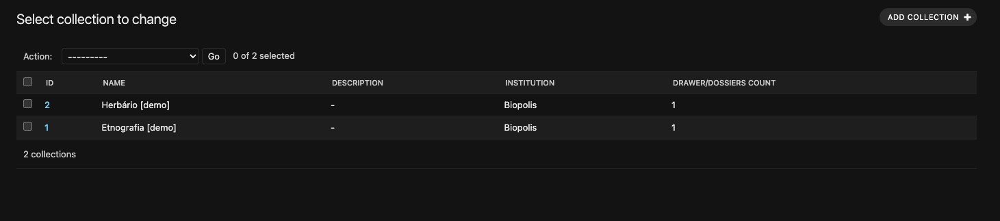
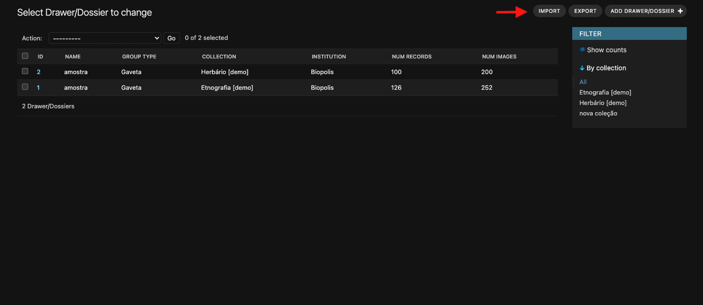

# Ferramentas para automatizar o carregamento de documentos para a platafora Arquivo-MHNC-UP

# Fases do processo
#### O _workflow_ para carregar documentos para a plataforma divide-se em 4 fases:
1. __Digitalização__ - captura e organização das imagens.
2. __OCR__ - submeter as imagens a um motor OCR (Google Cloud Vision) para extrair o texto.
3. __Upload de ficheiros__ - Organizar e gerar thumbnails das imagens para carregar para o armazenmento.
4. __Atualizar base de dados__ - gerar ficheiros csv com os dados das imagens para adicionar às tabelas da base de dados.

Este _workflow_ incluí vários scripts que tem como objectivo automatizar as diferentes fases dos processos. Como o estado dos ficheiros pode diferir, os scripts são individuais e podem ser corridos conforme a necessidade.

Para correr os scripts de automatização de cada fase é necessário ter instalado uma versão de python igual ou superior a python 3.9. Para instruções de instalação, por favor, referir-se a https://www.python.org/.

Tendo um ambiente python a funcionar o repositório pode ser clonado ou baixado e após instaladas as bibliotecas necessárias todos os scripts ficam prontos para correr. Para instalar as bibliotecas necessárias correr o comando
```
make install
```

Antes de utilizar os scripts é necessário configurar o ficheiro __settings.py__ com as credenciais de acesso à base de dados e ao armazanemaneto de ficheiros por sftp.

## 1 - Digitalização

O processo de digitalização pode ser executado de diversas maneiras dependendo das tecnologias disponiveis. O importante será obter uma imagem digitalizada com qualidade suficiente para que o texto seja legível. Imagens ajustadas com um bom contraste facilitam o processo de OCR. As imagens devem ser guardadas em formato \*.jpg.

Este _workflow_ considera que apenas se adiciona documentos para uma colecção de cada vez.

A nomeação de cada ficheiro deve ser única e de preferência obdecendo a uma serialização numérica.

Este workflow implica usar num diretório principal de trabalho, daqui para a frente referenciado como _main_dir_, onde deverá ser criada a estrutura de ficheiros.

As imagens devem ser gravadas numa pasta com o nome do grupo/gaveta a que pertencem. Exemplo da estrutura de diretorios após a digitalizaçao das gavetas A e B:
```
└── main_dir
    ├── A
    │   ├── DSC_12345.jpg
    │   ├── DSC_12346.jpg
    │   ├── DSC_12347.jpg
    │   ├── (...)
    │   └── DSC_12447.jpg
    └── B
        ├── DSC_12448.jpg
        ├── DSC_12449.jpg
        ├── DSC_12450.jpg
        ├── (...)
        └── DSC_12521.jpg
```

Dependendo da tecnologia de digitalização usada, os ficheiro podem ser nomeados correctamanete no momento da captura, i.e., uma série sequencial a começar em 1 para cada gaveta.

Caso os ficheiros não sejam corretamente nomeados durante a captura, basta correr o script __seq_rename.py__, indicando o caminho para a pasta principal, onde se encontram as pastas das gavetas.

```
python3 seq_rename.py caminho/para/main_dir
```
É ainda possível definir o número máximo de algarismos, colocando zeros à esquerda, indicando o nº como argumento após indicar o caminho:

```
python3 seq_rename.py caminho/para/main_dir 5
```
Neste exemplo todos os números da sequencia iriam ter 5 algarismos (00001,00234,09876, etc). Por defeito, caso nenhum números seja indicado, os números serão de 4 algarismos (0001,0234,9876, etc)

Para o exemplo anterior a estrutura de ficheiros depois de correr o script deverá estar assim:
```
└── main_dir
    ├── A
    │   ├── 0001.jpg
    │   ├── 0002.jpg
    │   ├── 0003.jpg
    │   ├── (...)
    │   └── 0103.jpg
    └── B
        ├── 0001.jpg
        ├── 0002.jpg
        ├── 0003.jpg
        ├── (...)
        └── 0074.jpg
```


Cada registo pode conter três tipos de imagem : __frente__, __verso__ e  __associada__.
O tipo de imagem deve ser indicado num sufixo com a letra correspondente:
- f - front
- b -back
- a -associated

Como cada nome de ficha deve ser único é necessário acrescentar como prefixo a cada imagem o nome da gaveta.

Exemplo de nomeação final de fichas com frente e verso para a gaveta "A":
```
A_0001_f.jpg
A_0001_b.jpg
A_0002_f.jpg
A_0002_b.jpg
(...)
A_1230_f.jpg
A_1230_b.jpg
```

### Automatismo para renomear fichas com identificação

Dependendo da ordem de digitalização e da natureza das imagens, esta identificação poderá ser feita de muitas maneiras, que poderá ou não obedecer um padrão, requerendo ou não algum trabalho manual.

Criou-se no entanto um automatismo que tenta abordar as situações mais comuns:

* O grupo de imagens digitalizadas contém só frente do documento

Se as imagens digitalizadas forem todas correspondente a frentes de documentos, basta acrecentar um "\_f" no final de todas as imagens. Correr:
```
python3 rename_types.py caminho/para/main_dir --all-f 
```

- O grupo de imagens digitalizadas contém frente e verso do documento

Para fichas com frente e verso, os ficheiro devem ser digitalizados e guardados sequencialmente, obedecendo sempre à ordem frente, verso, frente, verso, ..., independentemente se o verso tem ou não conteúdo, de modo que numa sequencia 001, 002, 003, 004 ..., um número impar corresponda a uma frente e o par imediatamente a seguir corresponda ao seu verso. Por exemplo, 001.jpg e 002.jpg serão respetivamente a frente e o verso da mesma ficha. Correr:
```
python3 rename_types.py caminho/para/main_dir --f-and-b
```

- O grupo de imagens digitalizadas contém frente do documento e uma imagem associada

Aqui aplica-se o mesmo princípio do caso anterior, mas com a letra _a_ para indicar que é uma imagem associada. Assim, numa sequência 001, 002, 003, 004 ..., um número impar corresponderá a uma frente e o par imediatamente a seguir corresponderá à imagem associada. Correr:

```
python3 rename_types.py caminho/para/main_dir --f-and-a # para imagens com imagens associadas
```

Em todos os casos o nome da pasta é acrescentado como prefixo a cada ficheiro.

Exemplo de estrutura de ficheiros depois da renomeação para o caso de frentes e versos:
```
└── main_dir
    ├── A
    │   ├── A_0001_f.jpg
    │   ├── A_0001_b.jpg
    │   ├── A_0002_f.jpg
    │   ├── (...)
    │   └── A_0103_f.jpg
    └── B
        ├── B_0001_f.jpg
        ├── B_0001_b.jpg
        ├── B_0002_f.jpg
        ├── (...)
        └── B_0073_b.jpg
```

O importante será, ao chegar ao final esta fase, antes de proceder para o OCR, ter uma estrutura de ficheiros semelhante à ilustrada, e onde o nome de ficheiro obedeça ao formato:
```
<nome da gaveta>_<numero>_<tipo de imagem>.jpg
```

## 2 - OCR

Para efetuar o reconhecimento de carateres nas imagens (OCR - _optical character recognition_) usa-se o motor de OCR da google cloud vision.

Para isso, é necessário ter uma conta Google e criar um projeto com a API da Vision ativada na Google Cloud Console. É necessário também gerar uma chave de autenticação para a API, que deve ser guardada num ficheiro __ServiceAccountToken.json__.

O documento [__vision_tutorial.pdf__](assets/vision_tuturial.pdf) explica os passos necessários para criar uma conta, ativar os serviços e obter as credenciais.

O ficheiro __ServiceAccountToken.json__ deve ser colocado na mesma pasta onde se encontra o script __ocr.py__.

Será também necessário ativar o faturamento na google cloud para poder usar os serviços da Google Cloud Vision. Ver como aqui https://cloud.google.com/billing/docs/how-to/modify-project?hl=pt-br

Depois de tudo corretamente configurado, basta correr o script __GVC_ocr.py__ apontando o caminho para _main_dir_:
```
$python3 GVC_ocr.py caminho/para/main_dir
```
O texto extraído de cada imagem será gravado na mesma pasta das imagens, obtêm-se então uma estrutura similar a esta:

```
└── main_dir
    ├── A
    │   ├── A_0001_f.jpg
    │   ├── A_0001_f.txt
    │   ├── A_0001_b.jpg
    │   ├── A_0001_b.txt
    │   ├── A_0002_f.jpg
    │   ├── A_0002_f.txt
    │   ├── (...)
    │   ├── A_0103_f.txt
    │   └── A_0103_f.txt
    └── B
        ├── B_0001_f.jpg
        ├── B_0001_f.txt
        ├── B_0001_b.jpg
        ├── B_0001_b.txt
        ├── B_0002_f.jpg
        ├── B_0002_f.txt
        ├── (...)
        ├── B_0073_f.jpg
        └── B_0073_b.txt
```

## 3 - Upload de ficheiros
Antes de fazer upload dos ficheiros para o servidor é preciso organizá-los e criar _thumbnails_ de cada imagem.

Uma vez que os ficheiros já contém como prefixo o nome da pasta a que pertencem, pode-se agora renomear cada pasta com o número que corresponderá à sua ID na base de dados. Para isso faz-se uma conexão ao armazenamento no servidor para verificar a pasta com maior número de ID. Após obter o número, as pastas serão renomeadas por ordem alfabética a partir do número imediatamente a seguir. Usando o exemplo de estrutura de ficheiros dado até aqui, se o número detetado fosse 11 a pasta A seria renomeada para 12 e a B para 13.

De seguida efetua-se uma cópia de cada gaveta só com os ficheiros "\*.jpg" para uma pasta exterior ao directório principal com o nome de "uploads". Nas pastas de cada gaveta aqui criadas, será acrescentado às imagens originais  o sufixo "\_normal", e será criado um _thumbnail_ para cada imagem que será gravado junto da imagem original com o sufixo"\_thumb".

Para realizar todas estas tarefas basta correr o script __prepare_upload.py__. (Comfirmar se os dados de acesso ao servidor estão configurados em __settings.py__)

```
$python3 prepare_upload.py.py caminho/para/main_dir
```
Opcionalmente, pode-se também ser indicar o caminho para onde criar a pasta "uploads". Se nenhum caminho for indicado, a pasta será criada no mesmo nível que main_dir.
```
$python3 prepare_upload.py.py caminho/para/main_dir caminho/para/uploads
```
Considerando que a pasta com maior nº de ID no servidor é 11 O diretório "uploads" deverá ter a seguinte estrutura ( da mesma maneira o nome das pastas em _main_dir_ também é alterado para a id atribuída):
```
uploads
├── 12
│   ├── A_0001_b_normal.jpg
│   ├── A_0001_b_thumb.jpg
│   ├── A_0001_f_normal.jpg
│   ├── A_0001_f_thumb.jpg
│   ├── A_0002_b_normal.jpg
│   ├── A_0002_b_thumb.jpg
│   ├── A_0002_f_normal.jpg
│   ├── A_0002_f_thumb.jpg
│   └── (...)
└── 13
    ├── B_0001_b_normal.jpg
    ├── B_0001_b_thumb.jpg
    ├── B_0001_f_normal.jpg
    ├── B_0001_f_thumb.jpg
    ├── B_0002_b_normal.jpg
    ├── B_0002_b_thumb.jpg
    ├── B_0002_f_normal.jpg
    ├── B_0002_f_thumb.jpg
    └── (...)
```

Agora, a pasta está pronta para ser carregada para o servidor. O processo pode ser feito manualmente usando software que realize transferência de ficheiros por sftp (FileZilla, por ex.), copiando todas as pastas do diretorio uploads para a pasta remota no servidor ou correndo o script __sftp_upload.py__ .

O script __sftp_upload.py__ permite carregar ficheiros para o servidor automaticamente.

 ```
python3 sftp_upload.py 
```

O script fará as verificações necessárias, confirmando sempre com o utilizador antes de fazer qualquer carregamento.


## 4 - Atualizar base de dados

A base de dados obedece ao seguinte esquema:


A base de dados oferece suporte para a criação de mais do que uma instituição (_records_institution_). No caso concreto, apenas interessa a criação de uma instituição (Biopolis), cujo o registo já está criado na base de dados.

Uma instituição pode ter uma ou mais colecções(_records_collection_). Foram criados dois registos de colecções que tem apenas propósito demonstrativo - Etnografia[demo] e Herbário[demo].

Cada colecção pode ter uma ou mais gavetas/grupo de fichas (_records_group_). Foi criada uma gaveta de amostra para cada coleção com o nome "amostra".

Cada gaveta pode conter uma ou mais fichas (_records_record_). Foram introduzidos 126 registos de fichas para a gaveta de "amostra" da colecção "Etnografia" e 100 registos na gaveta "amostra" para a colecção "Herbário".

Cada ficha pode ter associada uma ou mais imagens (_records_image_). As fichas da gaveta "amostra" da colecção "Etnografia" têm 252 imagens associadas (frente e verso) e as fichas da gaveta "amostra" da colecção "Etnografia" têm 200 imagens associadas (frente e associada).

Antes de adicionar os registos à base de dados é necessário criar tabelas em ficheiros csv devidamente formatadas para que se possa importar mais do que um registo de cada vez.

A ordem de inserção de dados deve ser feita respeitando as dependências das tabelas:

instituição -> coleção -> grupo -> ficha -> imagem

Assim, o primeiro passo será aceder ao painel de admnistração atravé do link na página principal e introduzir as credenciais solicitadas.

Do lado esquerdo, no separador "RECORDS" pode-se aceder a todas as tabelas da base de dados:



Clicando em _institutions_, pode-se ver a instituição "Biopolis" já criada:



Clicando em _collections_, pode-se ver as colecções de demonstração criadas e criar uma nova colecção:



Para preparar os dados para a coleção é necessário usar o nº de ID da mesma. No exemplo apresentado na animação, pode-se ver que a coleção criada - "nova colecção" ficou com ID, automaticamente atribuído, 7.

Com a estrutura de ficheiros obtida no passo 1 e com a coleção criada, tem-se todos os dados necessários para criar as tabelas dos registos das gavetas, fichas e respetivas imagens.

Para isso basta correr o script de automação para o efeito indicando o caminho para o _main_dir_ e o nº de id da coleção.

Como se verá mais à frente a atualização da base de dados pode ser feita de duas maneiras, [através do painel de administração](#Através-do-painel-de-administração) ou [através da linha de comandos](#Através-da-linha-de-comandos). Na preparação dos csv's, dever-se-á ter em atenção de que modo se deseja proceder, porque a formatação do cabeçalho dos ficheiros difere ligeiramente.

Assim, se se desejar utilizar a interface do painel de administração correr:

```
python3 build_csv_admin.py caminho/para/main_dir <id_da_coleção>
```
caso se queira carregar pela linha de comandos:
```
python3 build_csv_cli.py caminho/para/main_dir <id_da_coleção>
```
Neste caso <id_da_coleção> seria substituído pelo o número 7, correspoindente à ID da "nova coleção".

Opcionalmente, pode-se ainda acrescentar um terceiro argumento defenindo o caminho para onde gravar os ficheiros csv:

```
python3 build_csv_admin.py caminho/para/main_dir <id_da_coleção> caminho/personalizado/para/ficheiros/csv
```
( ou build_csv_cli.py, como já explicado)

Caso não seja dado nenhum caminho, os ficheiros serão guardados numa pasta - "csv_data" no interior do _main_dir_.

Ambos os scripts de construçaõ dos csv's fazem uso the __get_max_id.py__ que se connecta à base de dados para obter o número de IDs mais alto de cada tabela, para atribuir novas IDs aos novos dados sem causar confilto (a ID tem de ser única para cada registo)

__get_max_id.py__ pode também ser usado de forma independente para vizualizar o id máximo de uma qualquer tabela da base de dados, por exemplo:
```
$python3 get_max_id.py records_record
#output:
#Highest ID in table 'records_record': 50239
```

Depois de correr o script deverão ser criados três ficheiros, correpondente às restantes 3 tabelas da base de dados:
```
.
├── records_group.csv
├── records_image.csv
└── records_record.csv
```

Obtidos os ficheiros, pode-se fazer o carregamento dos dados para a base de dados de duas maneiras:

### Através do painel de administração

Como já indicado o carregamento de dados deve ser feito na ordem de menor para maior dependencia. Assim, a próxima tabela a ser atualizada deverá ser a dos grupos/gavetas.

Seguir os seguintes passos:
 - No painel de administração, no separador "RECORDS", clicar em "Drawer/Dossiers".
 - No canto superior direito clicar em "import"
 - Clicar em escolher ficheiro e selecionar o ficheiro "records_group.csv"
 - Confirmar que o selector "Format" mudou automaticamente para csv
 - Clicar em "SUBMIT"
 - Vizualizar a tabela de dados a carregada e confirmar se está em conformidade
 - Confirmar a importação clicando em "CONFIRM IMPORT"



Os mesmos passos deverão ser igualmente seguidos para as restantes tabelas - Records e Images - apenas mudando o ficheiro csv a carregar.

O nome das instituições, coleções e grupos pode ser mudado a qualquer altura, no painel de administraçaõ sem afetar a integridade da base de dados.


Pode-se também carregar os dados para a base de dados pela linha de comandos


### Através da linha de comandos

Depois dos ficheiros csv criados com o script apropriado, pode-se fazer o carrregamneto dos dados das 3 tabelas executando apenas o seguinte comando:
```
python3 update_db.py caminho/para/csv_data
```

Se todos os passos do projecto foram seguidos, após o script terminar,os documentos deverão estar disponíveis na plataforma.

### Apagar dados da base de dados

Qualquer registo da base de dados pode ser apagado tanto através do painel de administração como por a execução dos comandos abaixo indicados.

- apagar a instituição e todos os registos a ela associados (goups,records,images)
```
make del_institution ID=<id da instituição> 
```
- apagar a colecção e todos os registos a ela associados (goups,records,images)
```
make del_collection ID=<id da coleção> 
```
- apagar o grupo/gaveta e todos os registos a ela associados (records,images)
```
make del_group ID=<id do grupo> 
```
- apagar a ficha e todos os registos a ela associados (images)
```
make del_record ID=<id da ficha> 
```

